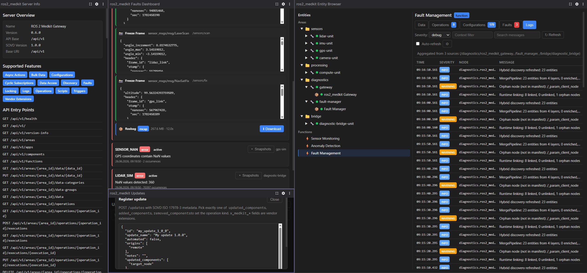

# ros2_medkit Diagnostics - Foxglove Extension



[Foxglove](https://foxglove.dev/) panels for live diagnostics of a ROS 2 system
through the [ros2_medkit gateway](https://github.com/selfpatch/ros2_medkit) - a
SOVD-aligned HTTP/REST + SSE API over the ROS 2 graph. Without leaving Foxglove
you can:

- Browse the entity tree (areas -> components -> apps) and inspect each entity's
  data, operations, configurations, logs and faults.
- Read and publish topics, run service and action operations, and edit ROS 2
  parameters.
- Watch faults stream in live and control entity lifecycle (start / restart /
  shutdown).
- Inspect the gateway itself - version, capabilities and API entry points.

The panels talk to the gateway over REST and SSE. Set the gateway URL (default
`http://localhost:8080`) once in any panel's settings; it is shared across all
panels.

## Panels

### ros2_medkit Entity Browser

A tree of areas -> components -> apps. Selecting an entity opens its resource
tabs, shown only for the capabilities the gateway reports (each with a count
badge):

- **Data** - read a topic's latest value, or publish a message to it (a
  schema-driven form when the gateway exposes the topic schema, otherwise a raw
  JSON editor).
- **Operations** - build a request/goal form from the operation schema, run
  service or action operations, and for actions poll execution status with
  progress, cancel and per-operation history.
- **Configurations** - type-aware editors per ROS 2 parameter (bool toggle,
  int/double inputs, string field, JSON for arrays), with per-parameter Reset
  and a Reset-all; parameters the gateway marks read-only are locked.
- **Logs** - query entity logs with a severity filter and context search;
  expandable rows show the source location (file:line) and full timestamp;
  optional auto-refresh pauses while the panel is hidden.

Apps and components also get a **lifecycle control**: a readiness badge plus a
lamp on the tree node, and start / restart / shutdown transitions gated by the
reported readiness. Disabled buttons are greyed and explained, every transition
except Start confirms first, and each result is reported with a toast.

### ros2_medkit Faults Dashboard

Real-time monitoring of all system faults: severity summary cards, SSE live
streaming, severity filtering, and fault clearing.

### ros2_medkit Updates

The SOVD `/updates` package catalog. Register packages (with client-side
validation) and run Prepare, Execute, Prepare & execute or Delete with live
status polling and per-update progress. Destructive actions confirm first, and a
clear banner is shown when the gateway has no UpdateProvider (HTTP 501).

### ros2_medkit Server Info

Gateway overview: server version, supported capabilities, and API entry points.

## Prerequisites

- A running [ros2_medkit gateway](https://github.com/selfpatch/ros2_medkit) (default at `http://localhost:8080/api/v1`)
- [Foxglove Studio](https://foxglove.dev/) (desktop app or web)

## Quick Start

```bash
# Install dependencies
npm install

# Build the extension
npm run build

# Install into Foxglove Studio (local development)
npm run local-install

# Package for distribution (.foxe file)
npm run package
```

After `local-install`, restart Foxglove Studio and add panels from the panel menu:
- **ros2_medkit Entity Browser**
- **ros2_medkit Faults Dashboard**
- **ros2_medkit Updates**
- **ros2_medkit Server Info**

## Configuration

Each panel has a settings editor (gear icon) where you configure:

- **Server URL** - Gateway address (e.g., `http://localhost:8080`)
- **Base path** - API path prefix (default: `api/v1`)

The Server URL and Base path are shared across all four panels (backed by
`localStorage`), so setting them on one panel updates the others. The Faults
Dashboard has additional, panel-local settings for refresh rate and SSE
streaming.

## Architecture

```
src/
├── index.ts                   # Extension entry - registers all four panels
├── types.ts                   # ros2_medkit gateway type definitions
├── gateway-client.ts          # Typed client factory (@selfpatch/ros2-medkit-client-ts)
├── api-dispatch.ts            # Per-entity-type typed path dispatch helpers
├── medkit-api.ts              # HTTP API client for ros2_medkit gateway
├── updates-api.ts             # SOVD /updates resource client
├── shared-connection.ts       # Cross-panel gateway connection (localStorage)
├── panel-hooks.ts             # Shared hooks (connection, settings editor, theme, dialog a11y)
├── schema-utils.ts            # JSON-schema to form model conversion + defaults
├── styles.ts                  # Inline style helpers (dark/light theme)
├── EntityBrowserPanel.tsx     # Entity tree + capability-driven detail tabs
├── EntityStatusControl.tsx    # Lifecycle status + transitions (apps/components)
├── DataPanel.tsx              # Data tab: topic list + per-topic publish form
├── ConfigurationsPanel.tsx    # Configurations tab: type-aware editors + reset
├── FaultsDashboardPanel.tsx   # Faults monitoring + SSE
├── LogsPanel.tsx              # Logs tab (severity/context filter, expandable rows, auto-refresh)
├── OperationRequestForm.tsx   # Schema-driven request/goal form (controlled)
├── OperationsPanel.tsx        # Operation request forms + execution lifecycle
├── ServerInfoPanel.tsx        # Server Info panel (gateway version, capabilities, API entry points)
├── UpdatesPanel.tsx           # SOVD updates catalog + actions
├── UpdateRow.tsx              # One update row (status badge, progress, actions)
├── RegisterDialog.tsx         # Register-update JSON dialog
├── DetailsDialog.tsx          # Update details (GET /updates/{id}) dialog
└── Modal.tsx                  # Shared modal shell for the Updates dialogs
```

The HTTP layer (`medkit-api.ts`, `updates-api.ts`) uses the generated typed client from
`@selfpatch/ros2-medkit-client-ts` (runtime dependency). `gateway-client.ts` builds an
openapi-fetch client bound to the current gateway connection; `api-dispatch.ts` routes
each call to the correct typed per-entity-type path.

## Compatibility

- Foxglove Studio ≥ 2.x
- ros2\_medkit gateway ≥ 0.2.0
- Supports both dark and light Foxglove themes

## Development

```bash
# Build in watch mode (if using foxglove-extension CLI v2+)
npm run build -- --mode development

# Production build
npm run build:prod
```

The extension uses inline styles (no external CSS) because Foxglove sandboxes extensions without access to global stylesheets. Theme colors adapt automatically based on Foxglove's `colorScheme` render state.

## Releasing

Releases are automated via GitHub Actions. To publish a new version:

1. Bump version: `npm version X.Y.Z` (updates both `package.json` and `package-lock.json`, creates a commit and tag)
2. Push: `git push origin main && git push origin vX.Y.Z`

CI will validate that the tag matches `package.json`, build the `.foxe`, and create a GitHub Release with:
- The `.foxe` file as a downloadable asset
- `sha256sum` and download URL ready for the [Foxglove extension registry](https://github.com/foxglove/extension-registry) PR

## License

Apache-2.0 — see [LICENSE](LICENSE).
